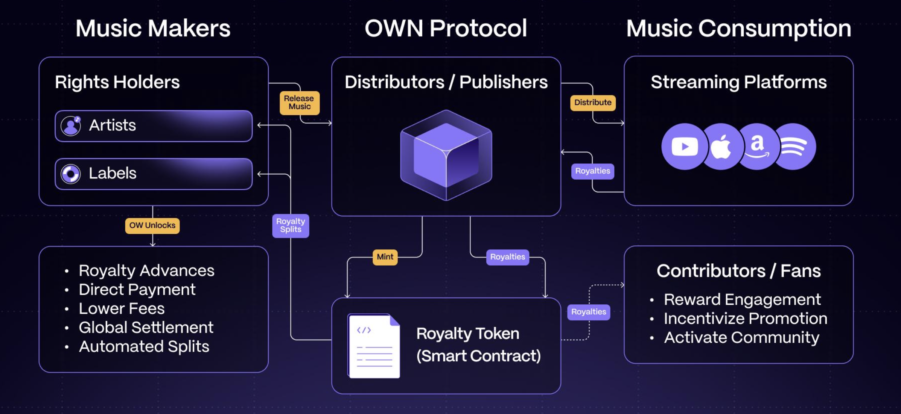

# User Flow

<figure><figcaption></figcaption></figure>

The journey begins with rights holders releasing music. When an artist or label is ready to release their work, they submit it to their distributor or publisher who acts as a protocol Royalty Admin. At this stage, the technical integration involves:

The Royalty Admin's role requires a simple technical integration that ingests standard music industry release messages. They run the OWEN (Original Work Electronic Notification) client which processes standard industry messages (DDEX.ERN for distributors, CWR for publishers). OWEN performs several critical functions: it parses these complex XML files, generates zero-knowledge proofs of their validity, and submits this data to the blockchain using blob storage (EIP-4844) for cost efficiency. The Royalty Admin's submission includes both the proof and a reference to the complete metadata stored on IPFS. The Original Works validator network picks up on those release transactions and calculates the proofs to ensure they are valid.

Although not shown in the diagram, the validator network plays a crucial role here. Validators run nodes that monitor these Royalty Admin submissions, verify the zero-knowledge proofs, and maintain a subgraph index of verified assets. They ensure both the current state of IP rights is readily available for applications and that a complete audit trail exists through distributed storage.

When minting Royalty Tokens, the Royalty Admin's systems must integrate with smart contracts that create ERC1155 tokens representing rights to collect revenue. Simultaneously, they establish a Merkle tree structure to maintain private records of revenue splits, ensuring that while ownership is tokenized, the actual split percentages remain confidential.

For royalty distribution, Royalty Admins integrate with on-ramp payment providers to convert incoming fiat payments to stablecoins. They operate Royalty Pools - smart contracts that hold these stablecoins and manage distributions. The technical integration here involve running a Royalty Pool client maintained by the Original Works core dev team alongside OWEN; The Roaylty Pool is a simple command line tool that covers, and is run locally to protect privacy of rights holders:

* Processing incoming royalty data from streaming platforms
* Converting payments through regulated on-ramps
* Updating Merkle trees with new revenue data
* Managing the smart contracts that process claims

Rights holders can then interact with these systems through various applications. To claim royalties, they present their ERC1155 tokens to generate zero-knowledge proofs of their ownership rights. The Royalty Pool smart contracts verify these proofs and release the appropriate stablecoin payments. This same infrastructure enables advanced features like royalty advances, where smart contracts can lock tokens as collateral and manage automated repayment from future royalty streams.

This technical architecture creates a bridge between traditional music industry operations and decentralized finance while maintaining privacy and efficiency throughout the entire process.
