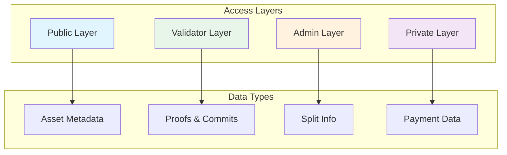

## Data Access Controls

### Access to sensitive information is strictly controlled:

- Royalty Admins manage their own trees and impose any controls or restrictions related to roylaty claims.
- Rights holders see only their shares and recieve cryptographic proof of their payout rate with each payment.
- Validators verify and secure public release notifications and associated assets.
- Public data limited to essential Metadata, assigned Identifiers and Royalty Admin.
- Access to private data is controlled by admin and rights-holder but always linked to a an independently-verifiable public redord.

