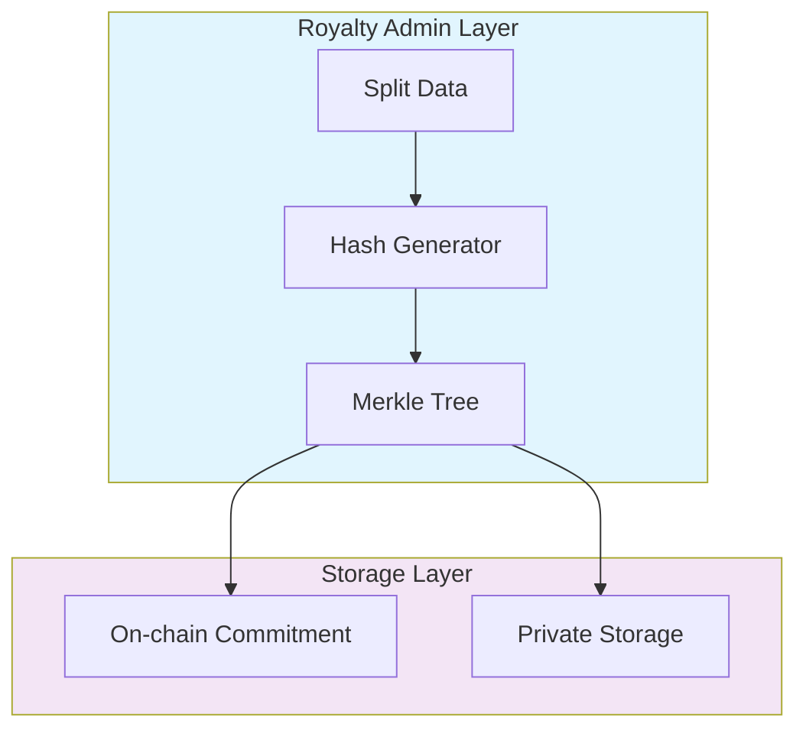

## Split data is stored and managed by Royalty Admins off-chain using Merkle trees for superior privace and data integrity:

- Splits are never exposed on-chain
- Only hashed commitments are published
- Each asset has its own Merkle tree
- Updates maintain audit trail without revealing values# Split Information Storage
- Selective disclosure support

### Layered Data Management:

**Private Layer (Royalty Admin)**

- Complete split information
- Full payment history
- Rights holder details
- Merkle tree management

**Public Layer (Blockchain)**

- Asset identifiers
- Hash commitments
- Proof verifications
- Registry updates

#### Storage Implementation:

- Each asset maintains its own Merkle tree
- Updates create new tree states
- Historical records are preserved
- Only commitments published on-chain
- Full data secured off-chain
- Access controlled by Royalty Admin

