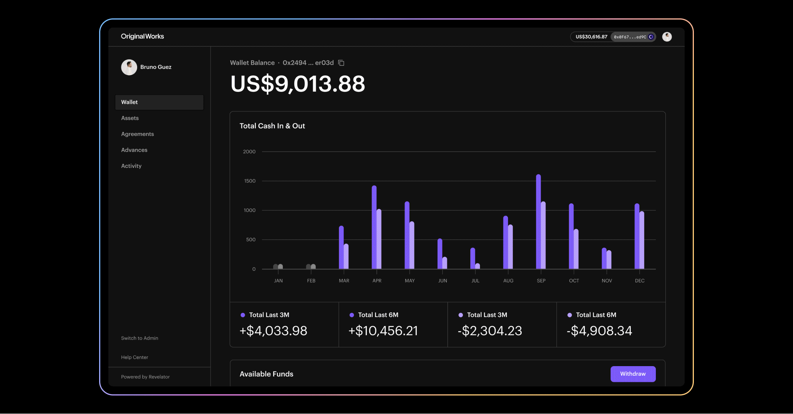

# Revelator Studio

### What is Revelator Studio?

Revelator Studio enables anyone to build a web3 business by leveraging the power of blockchain-based smart contracts with an easy-to-use web-based frontend.

With Revelator Studio, anyone can mint digital assets, collect on-chain royalties, sell NFTs and interact with DeFi protocols from a non-custodial web application.

### Who is Revelator Studio for?

Revelator Studio enables music teams and creators to manage the lifecycle of their digital assets to power Web3 commerce to fans and collectors.

Artist managers, record labels, publishers, brands and creators can easily&#x20;

* Create and sell NFT collectibles&#x20;
* Create artist tokens to build communities
* List, distribute and sell their NFTs on popular marketplaces or on custom storefronts&#x20;
* Earn resale royalties from every future sale&#x20;
* Manage your catalog of digital assets&#x20;

### Sign in to Creator Studio


