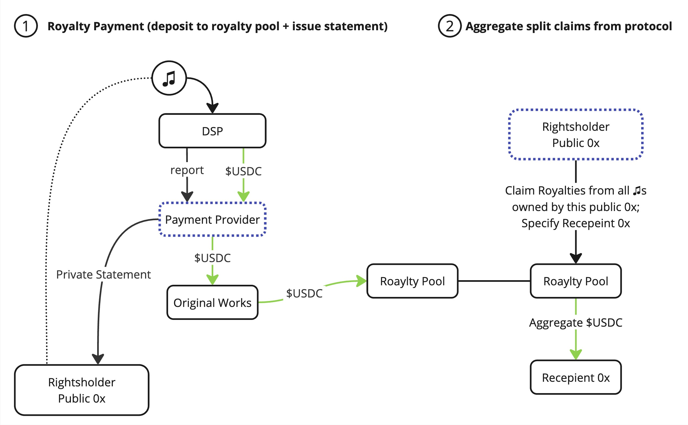

# Defining Music RWAs

As our goal is to provide liquidity and velocity to all creative industries, existing and emerging. When it comes to globally monetizing IP, understanding the complexities and incentives of all service providers along the supply chain of music IP is key.&#x20;

As trusted partners for artists, music labels, distributors and managers, we understand that rights-holders _need_ trusted service providers. We also understand the importance of privacy, trust and verifiability.&#x20;

Verifiability in the form of identification of Assets, Rights and Royalties records from official royalty administrators is key when attempting to tokenize music IP assets as RWAs.\
\
In order to have a digital asset that is trusted, the bond to its real-world underlying cashflow must be completely disambiguated in order for a new Original Works record to be created. Once verified, validated and fingerprinted the protocol will enable each royalty-collection contract (rights monetization deal) to be tokenization as a standalone native digital asset. \
\
Ensuring the Record is unique requires the registration of the following fields, enabling only a single (Rights Controller) Oracle can monetize  this record:

* Asset identifier (ISRC/ISWC)
* Right type being monetized (Distribution, Performance, Sync, etc..)
* Territory
* Share Percentage (0-100)\*

As long as less than 100% is captured, additional Orcales can claim a new record with the 3 first fields identical, but they can only register the remaining percentage.

If an oracle claims an existing record, then a period begins allowing both Rights Controllers perform a "handshake" and they are economically incentivized to address the migration sooner than later.\

<figure><figcaption>
The Original Works Data Model
</figcaption></figure>


Original Works does not intend to be an arbitrator of IP claims, but rather provide an immutable record of claims made by the rights-holders or their appointed service providers. \
\
OW ensures no duplicate claims can be made, and enforces penalties if off-chain arbitration is adjudicated - See more about the utilities of the $OWN token


### The benefits in clearly identifying the underlying deal that is being tokenized by a decentralized network enables new business oportunities for rights holders:

### Facilitate efficient and automated royalty payments.

Decentralization and protocol tokenomics are designed to incentivize fast and efficient royalty splits and last mile settlements.

### Enable verifiable credentials for protocol participants to ensure trust and authenticity.

Ensuring the privacy and integrity of the data remains the role of music administrators and service providers; by plugging into the Original Works protocol, they can drive more revenue for themselves and their customers without giving up on privacy and data security.

### Unlock liquidity and and financial tooling for artists and rights holders.

Making music IP-backed assets verifiable on-chain allows any human, application or protocol to evaluate the asset, unlocking friction in the market.

### Ensure private, immutable records of ownership and rights that can be easily proven by rights holders.

Once obtaining a hash of a registered asset on a public blockchain, ownership and monetization rights holders can enjoy self custody of their rights, and are able to independently leverage their assets with minimum dependency on intermediaries, while retaining full privacy.&#x20;

### Provide a decentralized Rights Registry for managing, and obtaining information about, music IP rights.

Once Rights Holders have secured their registrations on-chain using the same service providers they are used to working with, they are able to tokenize their assets to act in self-custody, delegate control or completely outsource management and monetization rights on an&#x20;
