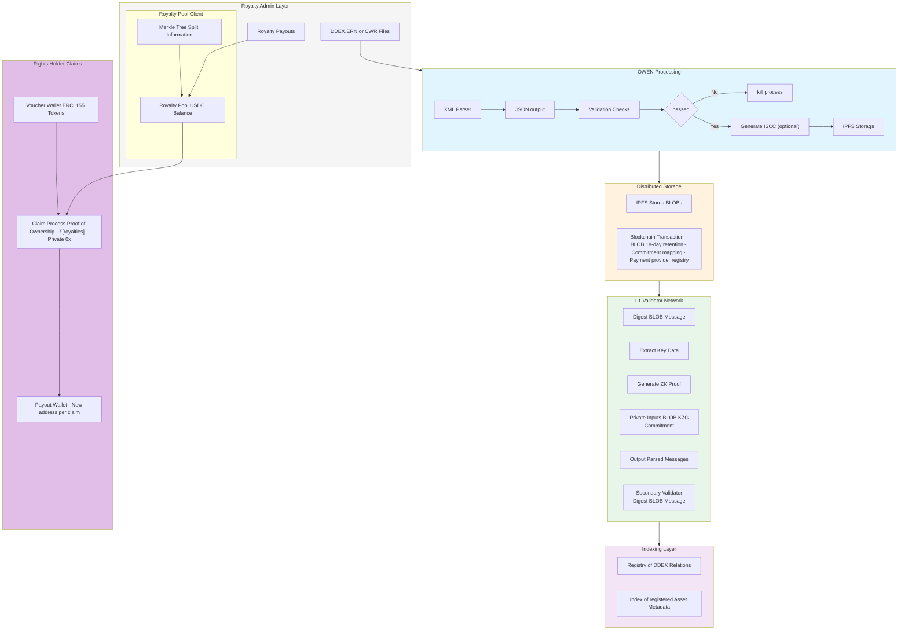

# Stakeholders Diagram

**Technical Implementation by Stakeholder:**

Rights Administrators (Distributors/Publishers):

* Run OWEN client to process standard industry messages
* Generate zero-knowledge proofs of valid submissions
* Submit data to blockchain through blob storage (EIP-4844)
* Operate Royalty Pools for stablecoin deposits
* Maintain Merkle trees of rights splits
* Process rights holder claims with privacy preservation
* Define claim Claim requirements (regulatory and compliance oversight)

Validators:

* Listen for Royalty Admin submissions on the network
* Verify zero-knowledge proofs of message validity
* Generate subgraph indices of verified assets
* Submit validation proofs through KZG commitments
* Maintain distributed storage of complete metadata
* Secure the minting of ERC1155 royalty contract tokens

Rights Holders:

* Receive ERC1155 royalty contract tokens representing revenue rights
* Hold tokens in separate wallets from claim addresses
* Generate proofs of ownership for royalty claims
* Claim stablecoin payments to new addresses
* Optionally transfer rights through token transfers

Smart Contracts:

* Manage ERC1155 token minting and transfers
* Process royalty claims with privacy preservation
* Verify proof submissions from validators
* Handle stablecoin deposits and withdrawals
* Maintain protocol security parameters
* Enable automated split payments

The separation between rights registration (secured by validators) and royalty distribution (managed by Royalty Admins) ensures both decentralized security and efficient operations, while the use of privacy-preserving mechanisms protects sensitive business relationships throughout the process.

