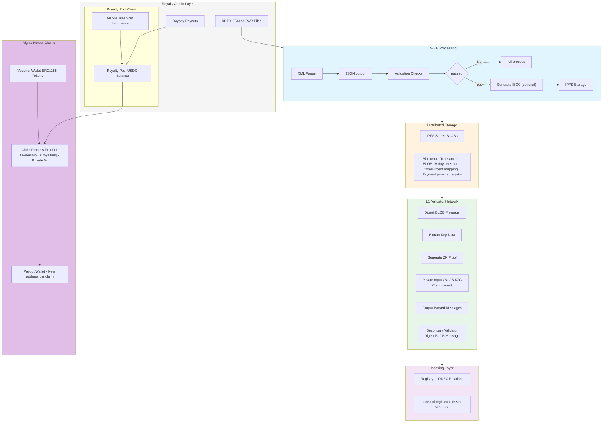

# Stakeholders Diagram

Royalty Admins generate authentic releases, independent Validators verify and stamp the releases (and audio fingerprint if applicable). Royalties are collected to verifiable, tampre proof smart contracts and claimed privately by rights-holders. Mazimizing perr-to-peer interaction with provenznce&#x20;

* Download the diagram from [here](main-flow.md)
* See the [next page](../introduction/stakeholders.md) for a breakdown of each step per stakeholder.

