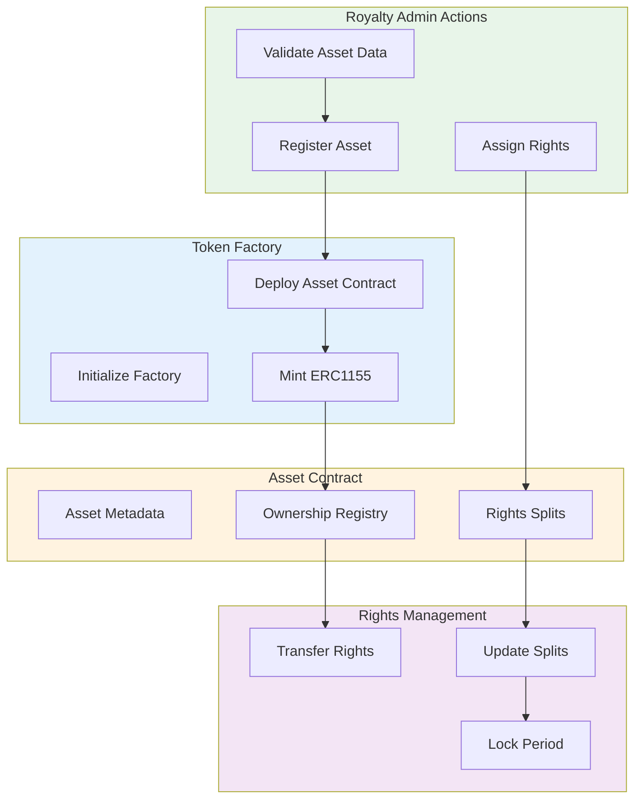

```mermaid
flowchart TB
    subgraph TokenFactory["Token Factory"]
        init["Initialize Factory"]
        deploy["Deploy Asset Contract"]
        mint["Mint ERC1155"]
    end

    subgraph AssetContract["Asset Contract"]
        metadata["Asset Metadata"]
        ownership["Ownership Registry"]
        splits["Rights Splits"]
    end

    subgraph RoyaltyAdmin["Royalty Admin Actions"]
        validate["Validate Asset Data"]
        register["Register Asset"]
        assign["Assign Rights"]
    end

    subgraph Rights["Rights Management"]
        transfer["Transfer Rights"]
        update["Update Splits"]
        lock["Lock Period"]
    end

    validate --> register
    register --> deploy
    deploy --> mint
    mint --> ownership
    assign --> splits
    
    ownership --> transfer
    splits --> update
    update --> lock

    style TokenFactory fill:#e3f2fd
    style AssetContract fill:#fff3e0
    style RoyaltyAdmin fill:#e8f5e9
    style Rights fill:#f3e5f5
```
