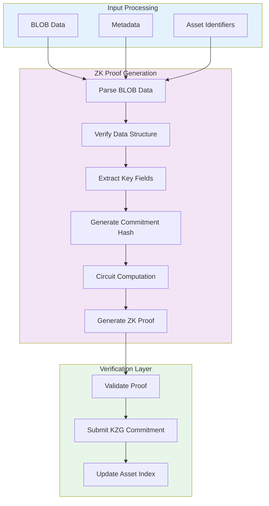

```mermaid
flowchart TB
    subgraph Input["Input Processing"]
        blob["BLOB Data"]
        meta["Metadata"]
        identifier["Asset Identifiers"]
    end

    subgraph ProofGen["ZK Proof Generation"]
        parse["Parse BLOB Data"]
        verify["Verify Data Structure"]
        extract["Extract Key Fields"]
        hash["Generate Commitment Hash"]
        circuit["Circuit Computation"]
        proof["Generate ZK Proof"]
    end

    subgraph Verification["Verification Layer"]
        validate["Validate Proof"]
        commit["Submit KZG Commitment"]
        index["Update Asset Index"]
    end

    blob --> parse
    meta --> parse
    identifier --> parse
    
    parse --> verify
    verify --> extract
    extract --> hash
    hash --> circuit
    circuit --> proof
    
    proof --> validate
    validate --> commit
    commit --> index

    style Input fill:#e3f2fd
    style ProofGen fill:#f3e5f5
    style Verification fill:#e8f5e9
```
